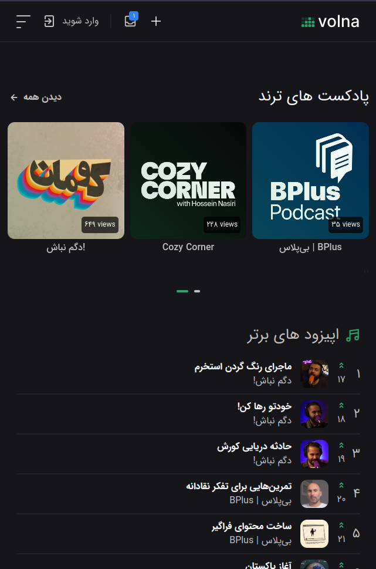
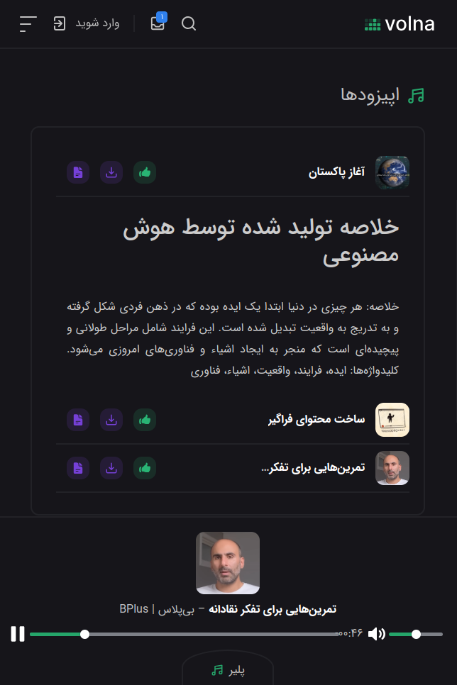

# 🎙️ Mini Podcasts Social Media Platform

Welcome to our **Mini Podcasts Social Media Platform**! 🚀

We are building a social media platform dedicated to **mini podcasts** ranging from **1 to 5 minutes**. Connect with others, share your thoughts, and discover new content in a whole new way. 🎧

## 🌟 Features

- **Latest**, **Most Popular**, and **Most Trending** mini podcasts and episodes 📈
- Advanced **Recommendation System** for personalized podcast and episode suggestions 🤖
- **Direct Uploading**: Everyone can upload their own mini podcasts easily 🎤
- **Community Interaction**: Comment on podcasts and like episodes to enhance recommendations 💬❤️

## 🧠 AI-Powered Enhancements

### Automated Transcripts & Summaries

- **Speech-to-Text**: Each episode is transcribed automatically 📝
- **AI Summarization**: Transcripts are summarized using **GPT 4o Mini** for quick insights 🧠
- **Smart Tags**: Generate intelligent tags for better content discovery 🔖

### AI Content Generation

- Analyze user interests based on listened topics and liked episodes 🎯
- **Custom Podcasts**: Generate personalized podcasts tailored to user preferences 🎁
- **RSS Integration**: Fetch latest articles, summarize, and translate them using **GPT 4o Mini** 📰
- **Text-to-Speech**: Convert summaries into mini podcasts using **آواشو** TTS, one of the best Farsi text-to-speech systems 🗣️

## 💰 Monetization Strategies

- **Sponsored Banners**: Display ads from sponsors like we currently do 🎯
- **Premium Users**: Offer unlimited access and more personalized content for subscribers 🌟
- **Sponsored Mini Podcasts**: Integrate sponsored content seamlessly, similar to YouTube ads 🎥

## 🛠️ Technologies Used

- **Backend**: Python, Django, Django REST Framework, Celery, Redis, OpenAI API 🐍
- **Frontend**: HTML, CSS, JavaScript, Bootstrap 🌐
- **Mobile Platform**: Cordova 📱
